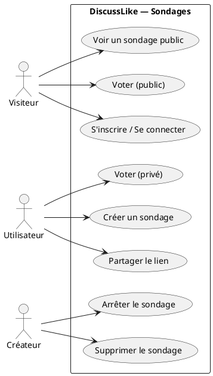

# Cas d'utilisation — Système de sondages

## Diagramme PlantUML

## Description des cas

| Cas | Acteur | Description |
|---|---|---|
| Voir un sondage public | Visiteur | Accès à `/poll/[id]` sans compte |
| Voter sur un sondage public | Visiteur | Vote identifié par IP |
| S'inscrire / Se connecter | Visiteur | Accès aux fonctions privées |
| Voter sur un sondage privé | Utilisateur | Requiert session active |
| Créer un sondage | Utilisateur | Via le bouton 📊 dans le chat |
| Ajouter un GIF par option | Créateur | GifPicker inline dans le modal |
| Définir une durée limite | Créateur | 15min → 7 jours → sans limite |
| Choisir public ou privé | Créateur | Toggle dans le modal de création |
| Générer un slug | Créateur | Ex: `/poll/meilleure-pizza` |
| Partager le lien | Utilisateur | Copie l'URL depuis la bannière ou après création |
| Arrêter le sondage | Créateur | Bouton ⏹ dans la bannière |
| Supprimer le sondage | Créateur | Bouton 🗑️ dans la bannière |
| Voir les résultats | Utilisateur | Barres de progression + % en temps réel |
